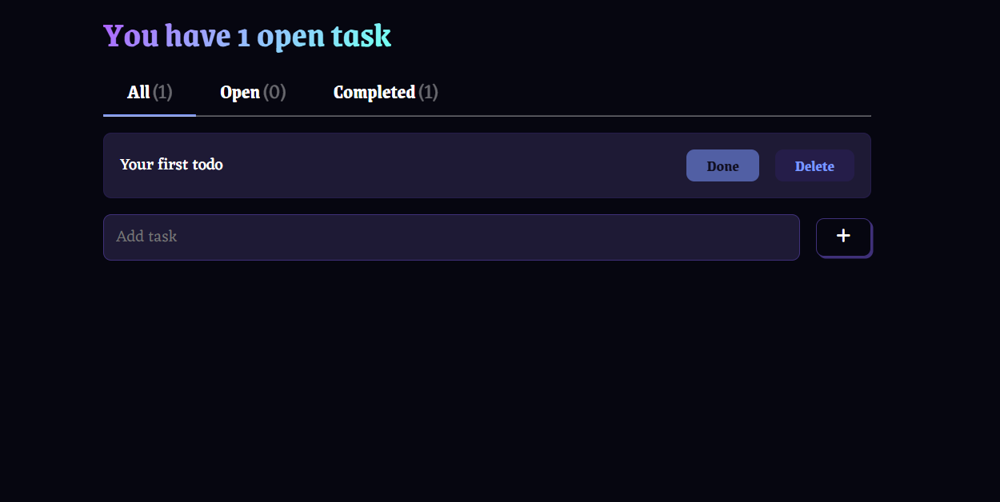

# Todo App in React.js


## 📌 Overview


### ✨ Features
- Local storage
- Mobile responsive

### 📸 Screenshot


### 🚀 Live Demo
[Live Demo](https://ultra-simle-todo-app.netlify.app/)

### 📦 Installation
```bash
git clone https://github.com/your-repo.git
cd your-repo
npm install
```

### 🏃‍♂️ Running Locally
```bash
npm run dev
```
Then, open [http://localhost:5173/](http://localhost:5173/) in your browser.

### 🏗️ Build for Production
```bash
npm run build
```

### 📡 Deployment
### Vercel / Netlify / Other
1. Connect your repository.
2. Configure environment variables.
3. Deploy!

### 💅 Styles 
- https://github.com/jamezmca/fantacss